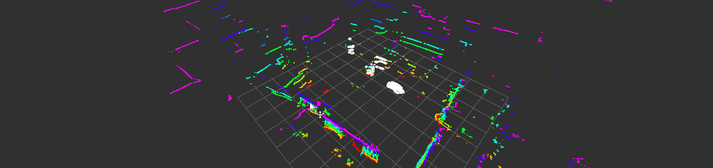

# lidar_body_tracking
ROS Catkin package to track people using ortree and cluster extraction from a fixed point.  
Sensor Used for testing: Quanergy M8  
Written and tested on: Ubuntu 16.04, ROS Kinetic  
  

## Installation
1. Make your catkin workspace:
    1. `mkdir -p ~/catkin_ws/src`
    2. `catkin_init_workspace ~/catkin_ws/src`
    3. `catkin_make -C ~/catkin_ws`
2. Clone this repo to your workspace:
    1. `git clone https://github.com/MyNameIsCosmo/lidar_body_tracking ~/catkin_ws/src`
3. Source your workspace
    1. `source ~/catkin_ws/devel/setup.sh`

## Running the tracking
1. Initialize your LIDAR, or play your ROSBAG  
    1. `rosbag play -l bagname.bag`
2. Launch 
    1. `source ~/catkin_ws/devel/setup.sh`
    2. `roslaunch lidar_body_tracking lidar_body_tracking.launch`

## Notes
1. The URDF frame is QP308. You can change this in `/urdf/m8.launch.xacro`  

## TODO:
- [ ] Dynamic Reconfigure for Link, Leaf size, min cluster, etc  
- [ ] Clustering of indicies for person detection  
- [ ] Output potential people to a topic  
- [ ] Control an RVIZ marker or something  
- [ ] Support body tracking while moving, loop closure and Odom tracking.  
- [ ] Comment and document code  

## References
[ROS WIKI URDF](http://wiki.ros.org/urdf)  
[ROS WIKI Xacro Reference](http://wiki.ros.org/xacro)  
